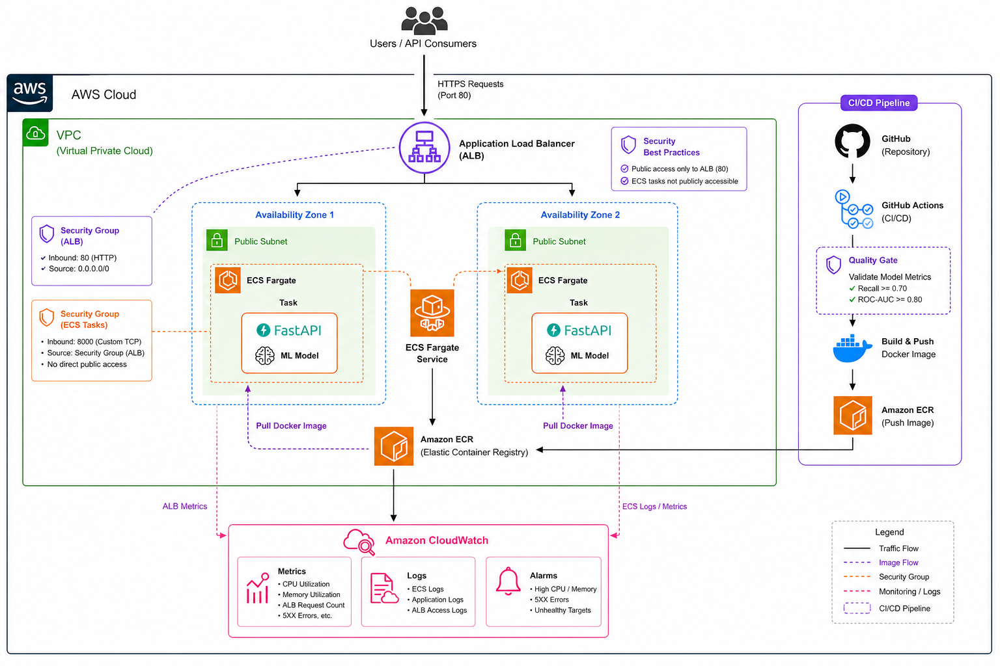
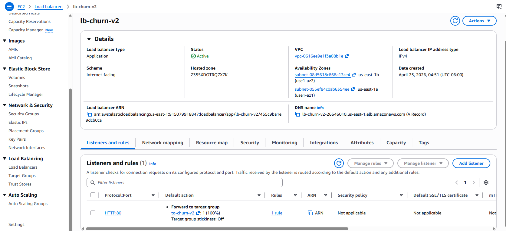
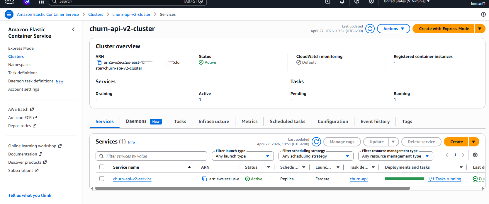
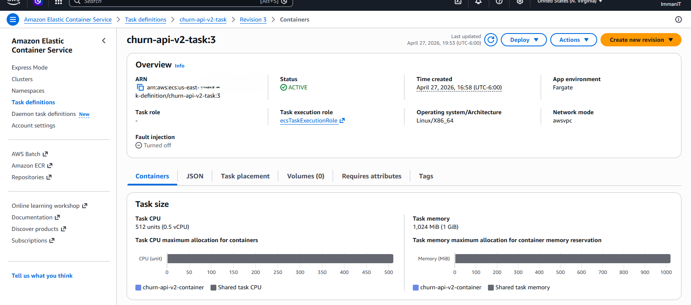
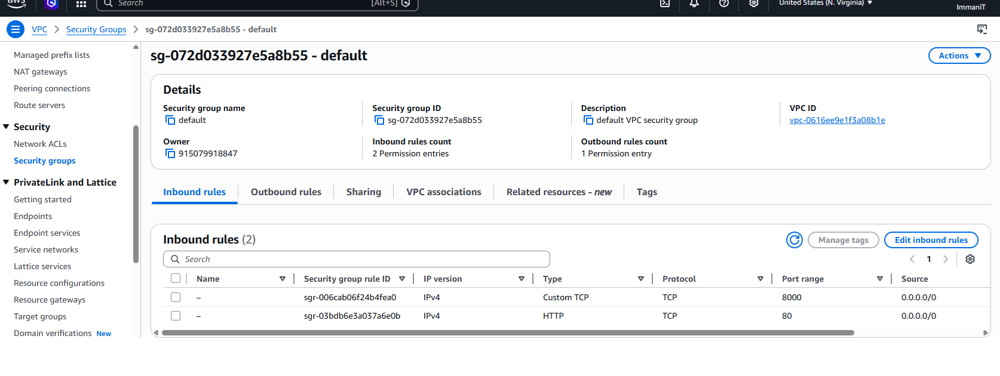
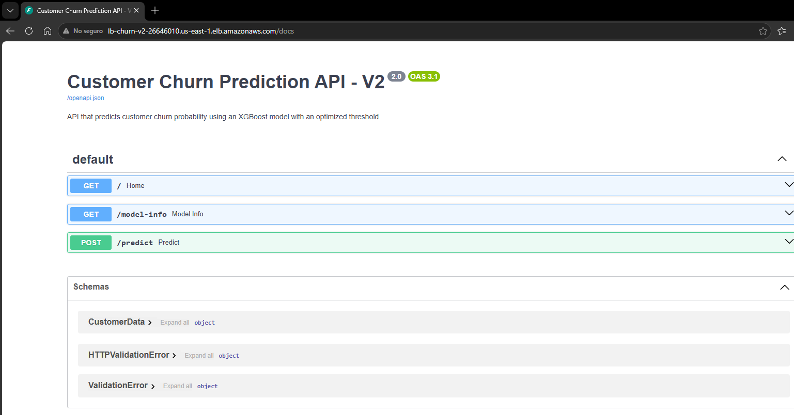
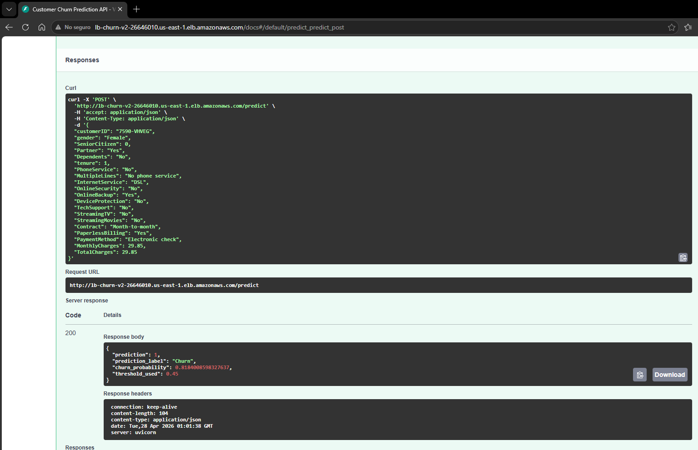
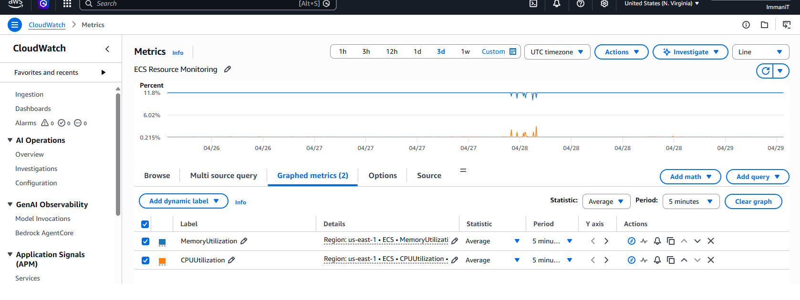
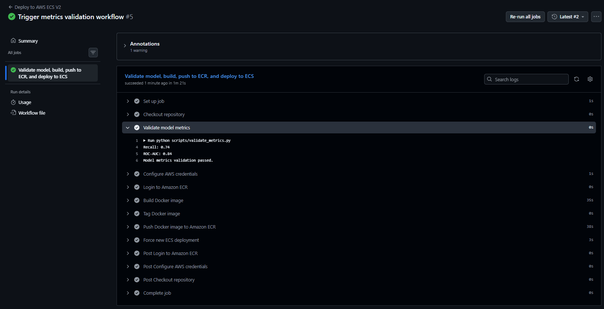

# 🚀 Customer Churn AWS Deployment v2

Production-grade deployment of an improved customer churn prediction model using AWS cloud services, CI/CD automation, metric validation gates, and scalable containerized infrastructure.

---

## 📌 Project Overview

This repository represents the **production deployment stage** of the second version of a complete Machine Learning workflow.

The project exposes an upgraded churn prediction model through a live API running on AWS with:

- **Docker** for containerization
- **Amazon ECS Fargate** for serverless container orchestration
- **Application Load Balancer (ALB)** for public traffic routing
- **Amazon ECR** for image storage
- **Amazon CloudWatch** for monitoring
- **GitHub Actions** for CI/CD automation
- **Metric validation gates** before deployment

The final result is a production-style ML API capable of receiving customer data and returning churn predictions in real time.

---

## 🔗 Project Continuity

This repository is part of a structured multi-repository portfolio demonstrating the full lifecycle of a Machine Learning solution.

### 1. Model Development v1  
**Repository:** [customer-churn-ml-v1](https://github.com/ImmaniTr/customer-churn-ml-v1)

Initial churn modeling workflow including EDA, preprocessing, baseline models, and first production candidate.

### 2. API Development v1  
**Repository:** [customer-churn-ml-api-v1](https://github.com/ImmaniTr/customer-churn-ml-api-v1)

Local FastAPI implementation used to operationalize the first trained model.

### 3. AWS Deployment v1  
**Repository:** [customer-churn-aws-deployment-v1](https://github.com/ImmaniTr/customer-churn-aws-deployment-v1)

First cloud deployment including ECS, ALB, CloudWatch, and CI/CD automation.

### 4. Improved Model v2  
**Repository:** [customer-churn-ml-v2](https://github.com/ImmaniTr/customer-churn-ml-v2)

Second generation churn model using improved training strategy, XGBoost, threshold optimization, and better predictive performance.

### 5. Current Repository  
**Repository:** [customer-churn-aws-deployment-v2](https://github.com/ImmaniTr/customer-churn-aws-deployment-v2)

This repository deploys the upgraded model with a more mature CI/CD workflow including metric validation before production release.

---

## 🏗️ Architecture



### Architecture Summary

- Users send HTTP requests to the deployed API
- Traffic enters through an **Application Load Balancer**
- Requests are routed to the **ECS Fargate service**
- The container runs **FastAPI + improved churn model**
- Logs and metrics are collected in **CloudWatch**
- New versions are deployed automatically through **GitHub Actions**
- Deployments only continue if model metrics pass validation thresholds

---

## ⚙️ AWS Infrastructure

### 🔹 Application Load Balancer



The ALB provides the public endpoint for the API and routes traffic to healthy ECS tasks.

---

### 🔹 ECS Service



The ECS service maintains the desired number of running containers and ensures service availability.

---

### 🔹 Task Definition



Defines compute resources, networking mode, runtime image, and deployment configuration.

---

### 🔹 Target Group Health



The target group confirms that only healthy containers receive production traffic.

---

## 🌐 Live API

### Swagger UI

The deployed API can be accessed here:

http://lb-churn-v2-26646010.us-east-1.elb.amazonaws.com/docs#/default/predict_predict_post

### Available Endpoints

- `GET /`
- `GET /model-info`
- `POST /predict`

---

## 📡 API Documentation



Swagger UI allows interactive testing directly from the browser.

---

## 🔮 Example Prediction



Example JSON response:

```json
{
  "prediction": 1,
  "prediction_label": "Churn",
  "churn_probability": 0.8184,
  "threshold_used": 0.45
}
```

---

## 📊 Monitoring with CloudWatch



CloudWatch is used to monitor:

- CPU utilization
- Memory utilization
- ECS operational visibility
- Service performance trends

This adds an observability layer to the production deployment.

---

## 🔁 CI/CD with GitHub Actions



A production workflow was implemented to automate deployment after validation.

### Pipeline Flow

Push to main  
→ checkout repository  
→ validate model metrics  
→ configure AWS credentials  
→ build Docker image  
→ push image to Amazon ECR  
→ force new ECS deployment

### Validation Gate (MLOps Style)

Before deployment, the workflow validates business-critical model metrics:

- Recall ≥ 0.74
- ROC-AUC ≥ 0.84

Only models that meet defined thresholds are promoted to production.

This introduces a basic **ML governance layer** into the deployment pipeline.

---

## 🔐 GitHub Secrets Used

- `AWS_ACCESS_KEY_ID`
- `AWS_SECRET_ACCESS_KEY`
- `AWS_REGION`
- `ECR_REPOSITORY`
- `ECS_CLUSTER`
- `ECS_SERVICE`

---

## 🧰 Tech Stack

- Python
- FastAPI
- Scikit-learn
- XGBoost
- Docker
- Amazon ECS Fargate
- Amazon ECR
- Application Load Balancer
- Amazon CloudWatch
- GitHub Actions

---

## 🎯 Key Skills Demonstrated

- End-to-end ML deployment
- API development with FastAPI
- Docker containerization
- AWS production deployment
- Load balancer integration
- Cloud monitoring
- CI/CD automation
- Metric-based release gates
- Model lifecycle improvement
- Practical MLOps foundations

---

## 📈 What Improved vs v1

- Stronger predictive model
- Threshold optimization
- Better production responses (`prediction_label`, threshold shown)
- Automated metric validation before deployment
- Cleaner CI/CD workflow
- More mature production readiness

---

## 🚧 Future Improvements

- Blue/Green deployment strategy
- Automatic rollback on failure
- Terraform infrastructure as code
- OIDC GitHub authentication
- MLflow experiment registry integration
- Drift monitoring in production

---

## 👤 Author

Immani Trejo  
Data Science | Machine Learning | Cloud Deployment

---

## 📌 Recruiter Note

This repository demonstrates the ability to move beyond model experimentation and deploy an improved Machine Learning solution into production.

It combines:

- Model improvement  
- API engineering  
- Docker packaging  
- AWS cloud deployment  
- Monitoring  
- CI/CD automation  
- Metric-based production governance

This reflects real-world skills expected in Data Science, ML Engineering, and MLOps environments.
